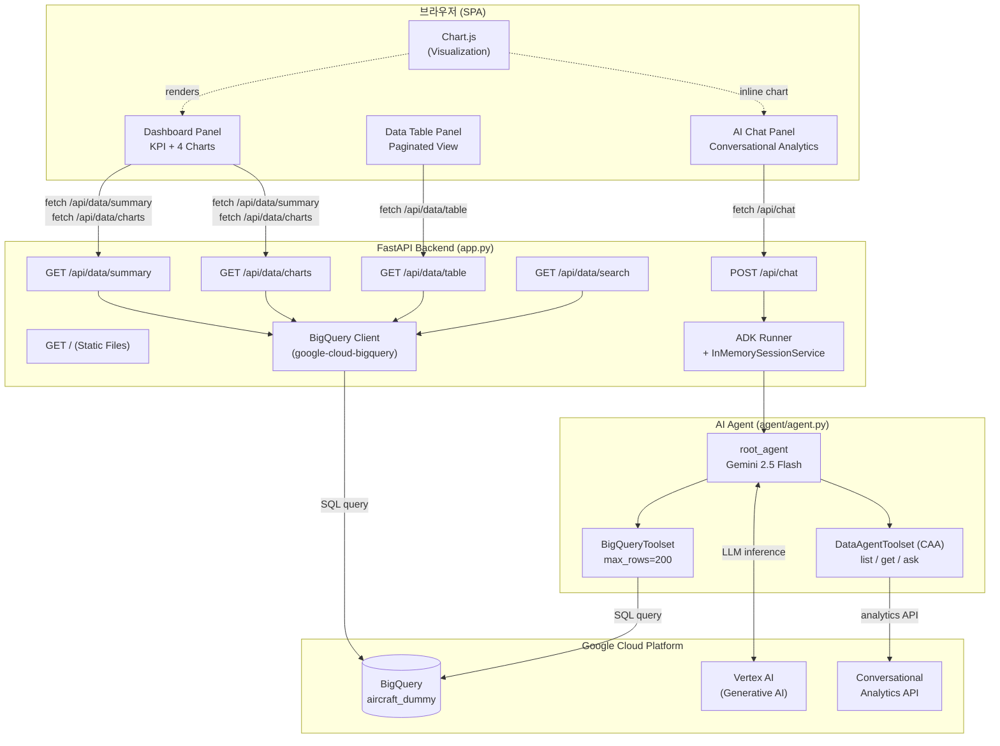
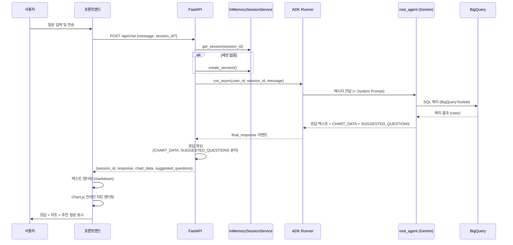
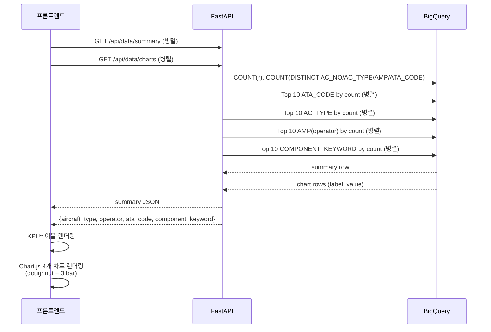
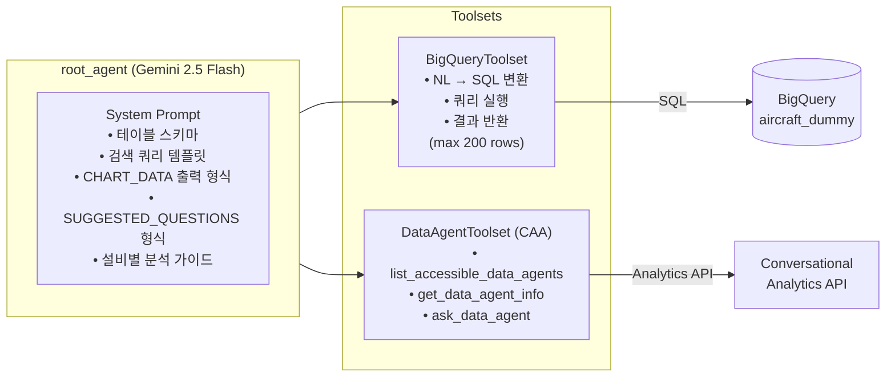

# Aircraft Intelligence Dashboard — Architecture

## 1. System Overview

Aircraft Intelligence Dashboard는 항공기 비정형 정비(NR) 기록을 AI 기반으로 분석하는 웹 애플리케이션입니다. Google Cloud BigQuery에 저장된 정비 데이터를 Gemini 2.5 Flash 기반 ADK 에이전트를 통해 자연어로 조회·분석할 수 있습니다.

```
┌─────────────────────────────────────────────────────────────┐
│                     사용자 브라우저                           │
│  ┌──────────────┐  ┌──────────────┐  ┌──────────────────┐   │
│  │  Dashboard   │  │  Data Table  │  │    AI Chat       │   │
│  │  (KPI+Chart) │  │  (Paginated) │  │ (ADK Agent)      │   │
│  └──────┬───────┘  └──────┬───────┘  └────────┬─────────┘   │
└─────────┼────────────────┼────────────────────┼─────────────┘
          │ HTTP REST       │                    │
          ▼                 ▼                    ▼
┌─────────────────────────────────────────────────────────────┐
│                FastAPI Backend  (app.py)                     │
│                                                             │
│  GET /api/data/summary   GET /api/data/charts               │
│  GET /api/data/table     GET /api/data/search               │
│  POST /api/chat          GET /  (SPA)                       │
│                                                             │
│  ┌──────────────────┐    ┌──────────────────────────────┐   │
│  │  BigQuery Client │    │  ADK Runner + Session Svc    │   │
│  └────────┬─────────┘    └──────────────┬───────────────┘   │
└───────────┼──────────────────────────────┼───────────────────┘
            │                              │
            ▼                              ▼
┌───────────────────┐          ┌───────────────────────────────┐
│  Google BigQuery  │          │  Google ADK Agent             │
│  cloud-cycle-pj   │◄─────────│  (Gemini 2.5 Flash)           │
│  mdas-dataset     │          │                               │
│  aircraft_dummy   │          │  ┌─────────────┐              │
└───────────────────┘          │  │ BigQuery    │              │
                               │  │ Toolset     │              │
                               │  └─────────────┘              │
                               │  ┌─────────────┐              │
                               │  │ DataAgent   │              │
                               │  │ Toolset(CAA)│              │
                               │  └─────────────┘              │
                               └───────────────────────────────┘
                                          │
                                          ▼
                               ┌───────────────────────┐
                               │  Vertex AI            │
                               │  (Google Generative AI)│
                               └───────────────────────┘
```

---

## 2. 컴포넌트 다이어그램 (Mermaid)



---

## 3. 채팅 요청 데이터 흐름 (Mermaid Sequence)



---

## 4. 대시보드 데이터 흐름



---

## 5. 파일 구조

```
aircraft/
├── app.py                  # FastAPI 백엔드 (API 엔드포인트, BQ 클라이언트, ADK 세션)
├── adk_runner.py           # CLI용 standalone ADK 실행기
├── agent/
│   ├── __init__.py         # root_agent export
│   └── agent.py            # ADK Agent 정의 (System Prompt + Toolsets)
├── static/
│   ├── index.html          # SPA 프론트엔드 (Dashboard + Table + Chat)
│   └── chart.min.js        # Chart.js v4 번들
├── requirements.txt        # Python 의존성
├── start.sh                # 가상환경 생성 + uvicorn 실행 스크립트
├── .env                    # 환경변수 (GCP 프로젝트, BQ 데이터셋 등)
└── .env.example            # 환경변수 템플릿
```

---

## 6. API 엔드포인트

| Method | Path | 역할 | 주요 파라미터 |
|--------|------|------|--------------|
| `GET` | `/` | SPA 진입점 (index.html) | — |
| `POST` | `/api/chat` | ADK 에이전트와 대화 | `message`, `session_id?` |
| `GET` | `/api/data/summary` | KPI 집계값 (총 NR 수, 항공기 수 등) | — |
| `GET` | `/api/data/charts` | 차트용 Top-10 분포 데이터 | — |
| `GET` | `/api/data/table` | 페이지네이션된 원시 테이블 | `limit`, `offset` |
| `GET` | `/api/data/search` | 전체 텍스트 검색 | `q`, `limit` |

### `/api/chat` 응답 구조

```json
{
  "session_id": "uuid-string",
  "response": "분석 텍스트 (마크다운)",
  "chart_data": {
    "type": "bar | doughnut | pie | line",
    "title": "차트 제목",
    "labels": ["A", "B", ...],
    "values": [100, 80, ...]
  },
  "suggested_questions": [
    "후속 질문 1",
    "후속 질문 2",
    "후속 질문 3"
  ]
}
```

---

## 7. ADK 에이전트 구조



### 에이전트 응답 파싱 규칙

에이전트는 응답 텍스트에 특수 마커를 삽입하여 구조화된 데이터를 전달합니다.

```
<응답 텍스트 (마크다운)>
CHART_DATA:{"type":"bar","title":"...","labels":[...],"values":[...]}
SUGGESTED_QUESTIONS:["질문1","질문2","질문3"]
```

FastAPI `POST /api/chat`은 이 마커를 파싱하여 각 필드를 분리한 뒤 JSON으로 반환합니다.

---

## 8. BigQuery 데이터 스키마

**테이블**: `cloud-cycle-pj.mdas-dataset.aircraft_dummy`

| 컬럼명 | 설명 |
|--------|------|
| `ID` | 레코드 식별자 |
| `NR_NUMBER` | 비정형 작업 지시 번호 |
| `MALFUNCTION` | 결함 설명 |
| `CORRECTIVE_ACTION` | 교정 조치 내용 |
| `NR_REQUEST_DATE` | NR 발생일 |
| `AC_TYPE` | 항공기 기종 (예: B737, A320) |
| `AC_NO` | 항공기 등록번호 |
| `MSG_NO` | 메시지 번호 |
| `AMP` | 운항사 / 정비 프로그램 |
| `COMPONENT_KEYWORD` | 관련 컴포넌트 키워드 (콤마 구분, 예: "ENGINE,APU") |
| `ATA_CODE` | ATA 챕터 코드 (항공기 시스템 식별) |
| `NR_WORKORDER_NAME` | 작업 지시 명칭 |

### COMPONENT_KEYWORD 처리 방식

`COMPONENT_KEYWORD`는 단일 셀에 콤마로 연결된 복수 키워드를 저장합니다. 집계 또는 검색 시 반드시 `UNNEST(SPLIT(..., ','))` 로 분리해야 합니다.

```sql
-- 키워드별 NR 건수 집계 (올바른 방법)
SELECT UPPER(TRIM(kw)) AS component, COUNT(*) AS nr_count
FROM `cloud-cycle-pj.mdas-dataset.aircraft_dummy`,
     UNNEST(SPLIT(COMPONENT_KEYWORD, ',')) AS kw
WHERE TRIM(kw) != ''
GROUP BY component
ORDER BY nr_count DESC
```

---

## 9. 기술 스택

| 레이어 | 기술 | 버전 |
|--------|------|------|
| 프론트엔드 | Vanilla HTML/CSS/JS | — |
| 시각화 | Chart.js | v4 |
| 백엔드 프레임워크 | FastAPI | ≥0.104 |
| ASGI 서버 | Uvicorn | ≥0.24 |
| AI 에이전트 프레임워크 | Google ADK | ≥1.23 |
| LLM | Gemini 2.5 Flash | — |
| 데이터 웨어하우스 | Google BigQuery | — |
| 인증 | Google Application Default Credentials | — |
| Python 런타임 | Python | 3.11 |
| 클라우드 플랫폼 | Google Cloud Platform | — |

---

## 10. 환경 변수

| 변수명 | 기본값 | 설명 |
|--------|--------|------|
| `GOOGLE_CLOUD_PROJECT` | `cloud-cycle-pj` | GCP 프로젝트 ID |
| `BIGQUERY_DATASET` | `mdas-dataset` | BigQuery 데이터셋 ID |
| `BIGQUERY_TABLE` | `aircraft_dummy` | BigQuery 테이블 ID |
| `BIGQUERY_REGION` | `asia-southeast1` | BQ 쿼리 리전 |
| `GOOGLE_CLOUD_LOCATION` | `asia-southeast1` | Vertex AI 리전 |
| `GOOGLE_GENAI_USE_VERTEXAI` | `true` | Vertex AI 백엔드 사용 여부 |
| `GOOGLE_APPLICATION_CREDENTIALS` | (선택) | 서비스 계정 키 파일 경로 |
