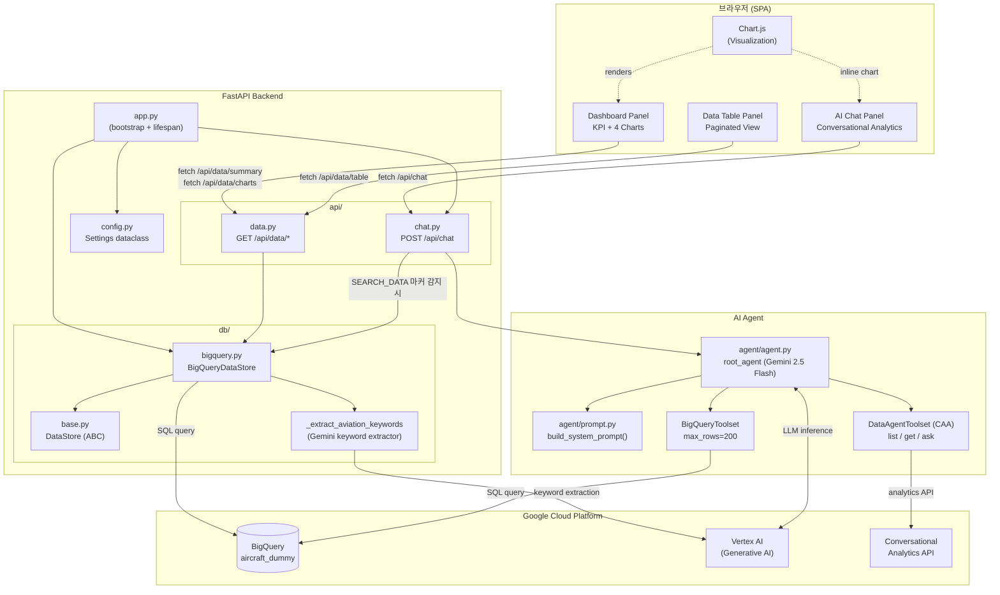
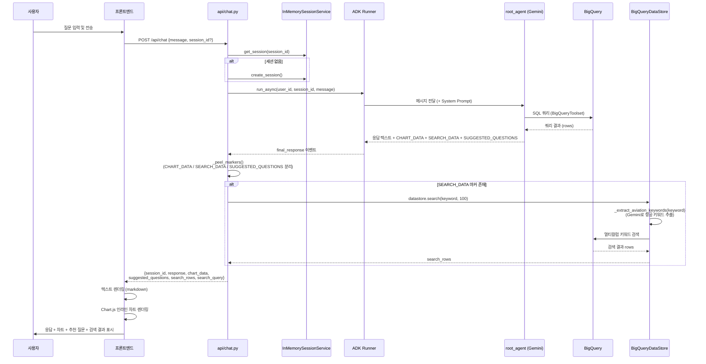
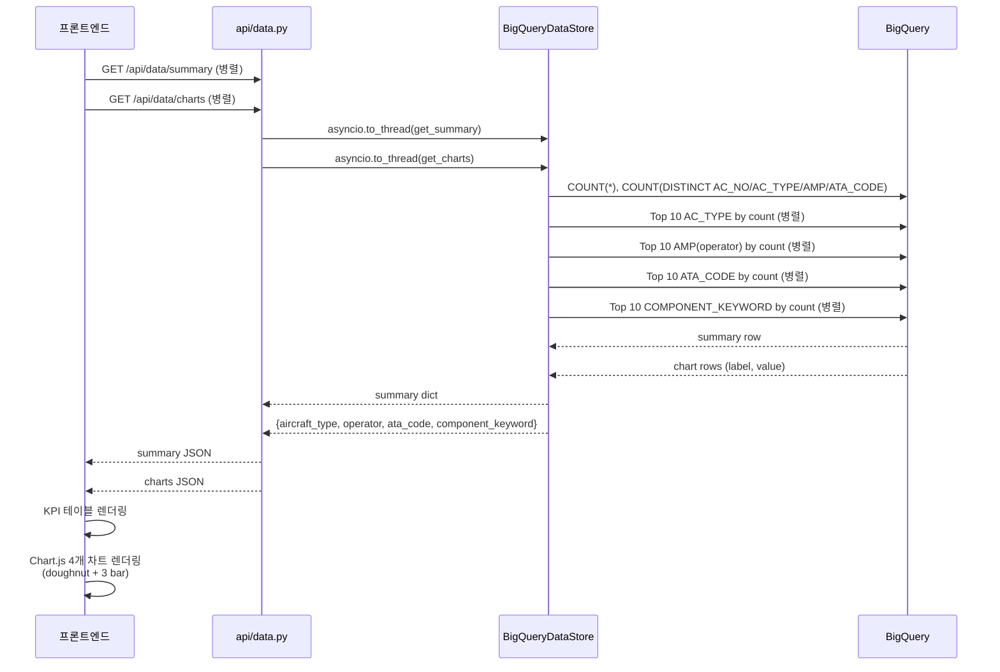
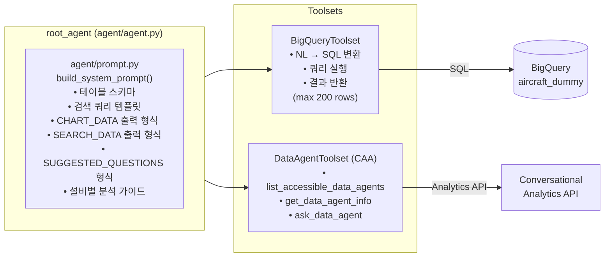
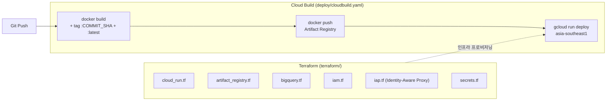

# Aircraft Intelligence Dashboard — Architecture

## 1. System Overview

Aircraft Intelligence Dashboard는 항공기 비정형 정비(NR) 기록을 AI 기반으로 분석하는 웹 애플리케이션입니다. Google Cloud BigQuery에 저장된 정비 데이터를 Gemini 2.5 Flash 기반 ADK 에이전트를 통해 자연어로 조회·분석할 수 있습니다.

```
┌─────────────────────────────────────────────────────────────┐
│                     사용자 브라우저                           │
│  ┌──────────────┐  ┌──────────────┐  ┌──────────────────┐   │
│  │  Dashboard   │  │  Data Table  │  │    AI Chat       │   │
│  │  (KPI+Chart) │  │  (Paginated) │  │ (ADK Agent)      │   │
│  └──────┬───────┘  └──────┬───────┘  └────────┬─────────┘   │
└─────────┼────────────────┼────────────────────┼─────────────┘
          │ HTTP REST       │                    │
          ▼                 ▼                    ▼
┌─────────────────────────────────────────────────────────────┐
│                FastAPI Backend                               │
│  app.py (bootstrap)  config.py (Settings)                   │
│                                                             │
│  ┌────────────────────────┐  ┌──────────────────────────┐   │
│  │    api/data.py          │  │      api/chat.py          │   │
│  │  /api/data/*           │  │  POST /api/chat           │   │
│  └──────────┬─────────────┘  └──────────────┬───────────┘   │
│             │                               │               │
│  ┌──────────▼─────────────────────────────────────────────┐ │
│  │               db/bigquery.py (BigQueryDataStore)        │ │
│  │  get_summary / get_charts / get_table / search         │ │
│  │  + _extract_aviation_keywords (Gemini)                 │ │
│  └──────────────────────────┬──────────────────────────── ┘ │
└─────────────────────────────┼───────────────────────────────┘
                              │                 │
                              ▼                 ▼
             ┌───────────────────┐   ┌───────────────────────────────┐
             │  Google BigQuery  │   │  Google ADK Agent             │
             │  cloud-cycle-pj   │◄──│  agent/agent.py               │
             │  mdas-dataset     │   │  agent/prompt.py              │
             │  aircraft_dummy   │   │  (Gemini 2.5 Flash)           │
             └───────────────────┘   └───────────────────────────────┘
```

---

## 2. 컴포넌트 다이어그램 (Mermaid)



---

## 3. 채팅 요청 데이터 흐름 (Mermaid Sequence)



---

## 4. 대시보드 데이터 흐름



---

## 5. 파일 구조

```
aircraft/
├── app.py                  # FastAPI 앱 bootstrap (lifespan, 라우터 등록, static 마운트)
├── config.py               # Settings dataclass (환경변수 → frozen dataclass)
├── adk_runner.py           # CLI용 standalone ADK 실행기
│
├── api/
│   ├── __init__.py
│   ├── chat.py             # POST /api/chat (ADK Runner, 세션, 마커 파싱)
│   └── data.py             # GET /api/data/* (summary, charts, table, search)
│
├── db/
│   ├── __init__.py         # create_datastore() 팩토리
│   ├── base.py             # DataStore ABC (get_summary/charts/table/search)
│   └── bigquery.py         # BigQueryDataStore 구현 + Gemini 키워드 추출
│
├── agent/
│   ├── __init__.py         # root_agent export
│   ├── agent.py            # ADK Agent 정의 (BigQueryToolset + DataAgentToolset)
│   └── prompt.py           # build_system_prompt() — 프로젝트/데이터셋/테이블 주입
│
├── static/
│   ├── index.html          # SPA 프론트엔드 (Dashboard + Table + Chat)
│   └── chart.min.js        # Chart.js v4 번들
│
├── deploy/
│   └── cloudbuild.yaml     # Cloud Build CI/CD (build → push → Cloud Run 배포)
│
├── terraform/              # GCP 인프라 IaC
│   ├── main.tf             # provider, project 설정
│   ├── variables.tf / terraform.tfvars
│   ├── apis.tf             # 활성화할 GCP API 목록
│   ├── artifact_registry.tf
│   ├── bigquery.tf
│   ├── cloud_run.tf
│   ├── iam.tf
│   ├── iap.tf              # Identity-Aware Proxy
│   └── secrets.tf
│
├── Dockerfile              # python:3.11-slim 기반 컨테이너 이미지
├── requirements.txt        # Python 의존성
├── .env                    # 환경변수 (GCP 프로젝트, BQ 데이터셋 등)
└── .env.example            # 환경변수 템플릿
```

---

## 6. API 엔드포인트

| Method | Path | 역할 | 주요 파라미터 |
|--------|------|------|--------------|
| `GET` | `/` | SPA 진입점 (index.html) | — |
| `POST` | `/api/chat` | ADK 에이전트와 대화 | `message`, `session_id?` |
| `GET` | `/api/data/summary` | KPI 집계값 (총 NR 수, 항공기 수 등) | — |
| `GET` | `/api/data/charts` | 차트용 Top-10 분포 데이터 | — |
| `GET` | `/api/data/table` | 페이지네이션된 원시 테이블 | `limit`, `offset` |
| `GET` | `/api/data/search` | 전체 텍스트 검색 | `q`, `limit` |

### `/api/chat` 응답 구조

```json
{
  "session_id": "uuid-string",
  "response": "분석 텍스트 (마크다운)",
  "chart_data": {
    "type": "bar | doughnut | pie | line",
    "title": "차트 제목",
    "labels": ["A", "B", "..."],
    "values": [100, 80, "..."]
  },
  "suggested_questions": [
    "후속 질문 1",
    "후속 질문 2",
    "후속 질문 3"
  ],
  "search_rows": [{ "...": "..." }],
  "search_query": "검색에 사용된 키워드"
}
```

> `search_rows` / `search_query` 는 에이전트가 `SEARCH_DATA` 마커를 출력한 경우에만 포함됩니다.

---

## 7. ADK 에이전트 구조



### 에이전트 응답 파싱 규칙

에이전트는 응답 텍스트 말미에 특수 마커를 삽입합니다. `_peel_markers()` 함수(`api/chat.py`)가 이를 순서대로 파싱합니다.

```
<응답 텍스트 (마크다운)>
CHART_DATA:{"type":"bar","title":"...","labels":[...],"values":[...]}
SEARCH_DATA:{"keyword":"<검색 키워드>"}
SUGGESTED_QUESTIONS:["질문1","질문2","질문3"]
```

| 마커 | 조건 | 후속 처리 |
|------|------|-----------|
| `CHART_DATA` | 통계 데이터가 있을 때 | 프론트엔드 Chart.js로 인라인 렌더링 |
| `SEARCH_DATA` | 개별 레코드 키워드 검색 시 | 백엔드가 `BigQueryDataStore.search()` 재실행 → `search_rows` 반환 |
| `SUGGESTED_QUESTIONS` | 항상 | 프론트엔드 추천 질문 버튼으로 표시 |

### 키워드 추출 (Gemini)

`SEARCH_DATA` 키워드를 받아 `BigQueryDataStore.search()` 호출 시, `_extract_aviation_keywords()` 가 Gemini에게 자연어 문장에서 항공 정비 관련 키워드 최대 5개를 추출하도록 요청합니다. 추출된 각 키워드로 BigQuery를 개별 검색하고 중복 제거 후 결과를 합산합니다.

---

## 8. BigQuery 데이터 스키마

**테이블**: `cloud-cycle-pj.mdas-dataset.aircraft_dummy`

| 컬럼명 | 설명 |
|--------|------|
| `ID` | 레코드 식별자 |
| `NR_NUMBER` | 비정형 작업 지시 번호 |
| `MALFUNCTION` | 결함 설명 |
| `CORRECTIVE_ACTION` | 교정 조치 내용 |
| `NR_REQUEST_DATE` | NR 발생일 |
| `AC_TYPE` | 항공기 기종 (예: B737, A320) |
| `AC_NO` | 항공기 등록번호 |
| `MSG_NO` | 메시지 번호 |
| `AMP` | 운항사 / 정비 프로그램 |
| `COMPONENT_KEYWORD` | 관련 컴포넌트 키워드 (콤마 구분, 예: "ENGINE,APU") |
| `ATA_CODE` | ATA 챕터 코드 (항공기 시스템 식별) |
| `NR_WORKORDER_NAME` | 작업 지시 명칭 |

### COMPONENT_KEYWORD 처리 방식

`COMPONENT_KEYWORD`는 단일 셀에 콤마로 연결된 복수 키워드를 저장합니다. 집계 시 `UNNEST(SPLIT(..., ','))`, 검색 시 `EXISTS + UNNEST(SPLIT(..., ','))` 로 분리해야 합니다.

```sql
-- 키워드별 NR 건수 집계 (올바른 방법)
SELECT UPPER(TRIM(kw)) AS component, COUNT(*) AS nr_count
FROM `cloud-cycle-pj.mdas-dataset.aircraft_dummy`,
     UNNEST(SPLIT(COMPONENT_KEYWORD, ',')) AS kw
WHERE TRIM(kw) != ''
GROUP BY component
ORDER BY nr_count DESC
```

---

## 9. 기술 스택

| 레이어 | 기술 | 버전 |
|--------|------|------|
| 프론트엔드 | Vanilla HTML/CSS/JS | — |
| 시각화 | Chart.js | v4 |
| 백엔드 프레임워크 | FastAPI | ≥0.104 |
| ASGI 서버 | Uvicorn | ≥0.24 |
| AI 에이전트 프레임워크 | Google ADK | ≥1.23 |
| LLM | Gemini 2.5 Flash | — |
| 데이터 웨어하우스 | Google BigQuery | — |
| 인증 | Google Application Default Credentials | — |
| Python 런타임 | Python | 3.11 |
| 컨테이너 | Docker (python:3.11-slim) | — |
| CI/CD | Google Cloud Build | — |
| 컨테이너 레지스트리 | Google Artifact Registry | — |
| 서버리스 런타임 | Google Cloud Run | — |
| 인프라 관리 | Terraform | ≥5.x (google provider) |
| 클라우드 플랫폼 | Google Cloud Platform | — |

---

## 10. 환경 변수

| 변수명 | 기본값 | 설명 |
|--------|--------|------|
| `GOOGLE_CLOUD_PROJECT` | `cloud-cycle-pj` | GCP 프로젝트 ID |
| `BIGQUERY_DATASET` | `mdas-dataset` | BigQuery 데이터셋 ID |
| `BIGQUERY_TABLE` | `aircraft_dummy` | BigQuery 테이블 ID |
| `BIGQUERY_REGION` | `asia-southeast1` | BQ 쿼리 리전 |
| `GOOGLE_CLOUD_LOCATION` | `asia-southeast1` | Vertex AI 리전 |
| `GOOGLE_GENAI_USE_VERTEXAI` | `true` | Vertex AI 백엔드 사용 여부 |
| `DB_TYPE` | `bigquery` | 데이터스토어 유형 (`create_datastore()` 팩토리 선택자) |
| `GOOGLE_APPLICATION_CREDENTIALS` | (선택) | 서비스 계정 키 파일 경로 |

---

## 11. 배포 구조


